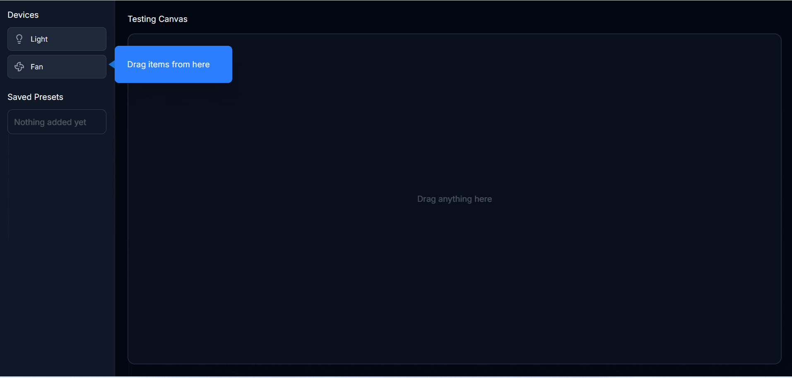

# Device Sandbox Simulator - Docker Setup

🐳 **Containerized version** of the Device Sandbox Simulator for easy deployment.



---

## 🚀 Quick Start (2 minutes)

### Prerequisites

- Docker Desktop or Docker Engine (20.10+)
- Docker Compose (2.0+)

### Installation

1. **Clone the repository:**

   ```bash
   git clone https://github.com/Mesbah-Tonmoy/Device-Sandbox-Simulator.git
   cd Device-Sandbox-Simulator
   ```

2. **Switch to Docker branch:**

   ```bash
   git checkout docker-react-php
   ```

3. **Copy environment file:**

   ```bash
   cp .env.example .env
   ```

4. **Start the application:**

   ```bash
   docker-compose up
   ```

5. **Access the application:**
   - Frontend: http://localhost:3000
   - Backend API: http://localhost:8080/api
   - Database: localhost:3307

That's it! 🎉

---

## 📦 What's Included

### Services

| Service      | Technology                   | Port | Description    |
| ------------ | ---------------------------- | ---- | -------------- |
| **Frontend** | React 19 + TypeScript + Vite | 3000 | User interface |
| **Backend**  | PHP 8.4 + Apache             | 8080 | REST API       |
| **Database** | MySQL 8.0                    | 3307 | Data storage   |

### Features

- ✅ **Hot Reload** - Frontend updates automatically
- ✅ **Data Persistence** - Database data saved in Docker volumes
- ✅ **Health Checks** - Automatic service monitoring
- ✅ **Isolated Network** - Services communicate securely
- ✅ **Auto-restart** - Services restart on failure
- ✅ **Log Management** - Centralized logging

---

## 🎯 Usage

### Starting the Application

```bash
# Start all services
docker-compose up

# Start in background (detached mode)
docker-compose up -d

# View logs
docker-compose logs -f

# View specific service logs
docker-compose logs -f frontend
docker-compose logs -f backend
docker-compose logs -f database
```

### Stopping the Application

```bash
# Stop all services
docker-compose down

# Stop and remove volumes (deletes all data)
docker-compose down -v

# Stop and remove images
docker-compose down --rmi all
```

### Rebuilding Services

```bash
# Rebuild all services
docker-compose build

# Rebuild specific service
docker-compose build frontend
docker-compose build backend

# Rebuild and start
docker-compose up --build
```

---

## 🔧 Configuration

### Environment Variables

Edit `.env` file to customize:

```ini
# Ports (change if conflicts exist)
FRONTEND_PORT=3000
BACKEND_PORT=8080
DB_PORT=3307

# Database credentials
DB_NAME=device_sandbox
DB_USER=sandbox_user
DB_PASS=your_password_here

# Versions
PHP_VERSION=8.4
NODE_VERSION=20
```

### Custom Ports

If default ports conflict with your system:

```ini
# Example: Use different ports
FRONTEND_PORT=3001
BACKEND_PORT=8081
DB_PORT=3308
```

Then access:

- Frontend: http://localhost:3001
- Backend: http://localhost:8081/api

---

## 📁 Project Structure

```
device-sandbox-simulator/
├── docker-compose.yml           # Main Docker configuration
├── .env                          # Environment variables
├── .env.example                  # Environment template
│
├── backend/
│   ├── Dockerfile                # Backend container config
│   ├── docker/
│   │   └── apache-config.conf    # Apache virtual host
│   ├── .dockerignore             # Files to exclude
│   └── ... (application files)
│
├── frontend/
│   ├── Dockerfile                # Frontend container config
│   ├── .dockerignore             # Files to exclude
│   └── ... (application files)
│
└── database/
    └── schema.sql                # Database initialization
```

---

## 🐛 Troubleshooting

### Issue: Port already in use

**Error:** `Bind for 0.0.0.0:3000 failed: port is already allocated`

**Solution:**

1. Stop the service using that port
2. Or change port in `.env`:
   ```ini
   FRONTEND_PORT=3001
   ```
3. Restart: `docker-compose up`

---

### Issue: Database connection failed

**Solution:**

1. Check if database is healthy:
   ```bash
   docker-compose ps
   ```
2. Wait for database initialization (30 seconds first time)
3. Check logs:
   ```bash
   docker-compose logs database
   ```

---

### Issue: Frontend can't connect to backend

**Solution:**

1. Verify backend is running:
   ```bash
   curl http://localhost:8080/api/devices/get.php
   ```
2. Check `API_BASE_URL` in `frontend\src\utils\constants.ts`
3. Clear browser cache
4. Rebuild frontend:
   ```bash
   docker-compose build frontend
   docker-compose up
   ```

---

### Issue: Changes not reflecting

**Frontend changes:**

- Hot reload is enabled by default
- If not working, restart: `docker-compose restart frontend`

**Backend changes:**

- Apache serves files from mounted volume
- Changes should be immediate
- If not, restart: `docker-compose restart backend`

**Database schema changes:**

- Stop containers: `docker-compose down`
- Remove volume: `docker volume rm device_sandbox_db_data`
- Start again: `docker-compose up`

---

## 🔍 Useful Commands

### Container Management

```bash
# List running containers
docker-compose ps

# Execute command in container
docker-compose exec backend bash
docker-compose exec frontend sh
docker-compose exec database mysql -u root -p

# View resource usage
docker stats

# Inspect service
docker-compose logs backend
```

### Database Access

```bash
# Connect to MySQL from host
mysql -h localhost -P 3307 -u sandbox_user -p

# Or from inside container
docker-compose exec database mysql -u sandbox_user -p device_sandbox

# Backup database
docker-compose exec database mysqldump -u root -p device_sandbox > backup.sql

# Restore database
docker-compose exec -T database mysql -u root -p device_sandbox < backup.sql
```

### Clean Up

```bash
# Remove stopped containers
docker-compose rm

# Remove unused images
docker image prune

# Remove unused volumes
docker volume prune

# Remove everything (use with caution)
docker system prune -a --volumes
```

---

## 📝 Development Workflow

1. **Make code changes** (hot reload handles the rest)
2. **Backend changes** reflect immediately (mounted volume)
3. **Database changes** require schema update:
   ```bash
   docker-compose exec database mysql -u root -p device_sandbox < database/schema.sql
   ```
4. **Test changes** at http://localhost:3000

---

## 🎯 Advantages Over Manual Setup

| Feature      | Docker                | Manual Setup          |
| ------------ | --------------------- | --------------------- |
| Setup Time   | 2-3 minutes           | 10-15 minutes         |
| Dependencies | Auto-installed        | Manual installation   |
| Consistency  | Same on all machines  | "Works on my machine" |
| Isolation    | Fully isolated        | System-wide           |
| Cleanup      | `docker-compose down` | Manual uninstall      |
| Portability  | Works anywhere        | OS-specific           |

---

## 📞 Support

### Documentation

- Main README: [react-php branch](../../tree/react-php)
- Docker Hub: https://hub.docker.com/

---

## 📄 License

This project is created for interview purposes and educational use.

---

## 👨‍💻 Author

Created by Md. Mesbah Hossain

---

## 🙏 Acknowledgments

- Docker for containerization
- React + TypeScript for frontend
- PHP + Apache for backend
- MySQL for database

---

**Ready to go! Just run `docker-compose up` and you're done! 🎉**
